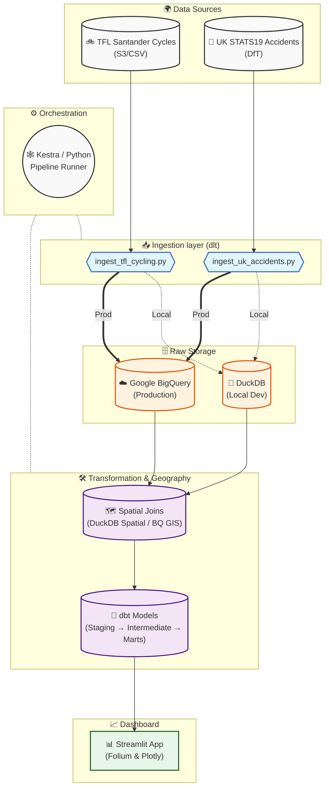

# data-engineering
Data Talk Club Zoomcamp - Data Engineering

```mermaid
flowchart TD
    %% Base styling
    classDef source fill:#f9f9f9,stroke:#333,stroke-width:2px,color:#333
    classDef ingest fill:#e1f5fe,stroke:#36c,stroke-width:2px,color:#333
    classDef store fill:#fff3e0,stroke:#e65100,stroke-width:2px,color:#333
    classDef transform fill:#f3e5f5,stroke:#4a148c,stroke-width:2px,color:#333
    classDef output fill:#e8f5e9,stroke:#1b5e20,stroke-width:2px,color:#333

    %% Data Sources
    subgraph Sources ["🌍 Data Sources"]
        direction LR
        tfl[("🚲 TFL Santander Cycles\n(S3/CSV)")]:::source
        dft[("🚗 UK STATS19 Accidents\n(DfT)")]:::source
    end

    %% Ingestion
    subgraph Ingestion ["📥 Ingestion layer (dlt)"]
        direction LR
        dlt_tfl{{"ingest_tfl_cycling.py"}}:::ingest
        dlt_dft{{"ingest_uk_accidents.py"}}:::ingest
    end

    %% Storage Layer
    subgraph Storage ["🗄️ Raw Storage"]
        direction LR
        duckdb[("🦆 DuckDB\n(Local Dev)")]:::store
        bq[("☁️ Google BigQuery\n(Production)")]:::store
    end

    %% Transformation Layer
    subgraph Transformation ["🛠️ Transformation & Geography"]
        spatial[("🗺️ Spatial Joins\n(DuckDB Spatial / BQ GIS)")]:::transform
        dbt[("🔄 dbt Models\n(Staging → Intermediate → Marts)")]:::transform
    end

    %% Presentation Layer
    subgraph Presentation ["📈 Dashboard"]
        streamlit["📊 Streamlit App\n(Folium & Plotly)"]:::output
    end
    
    %% Orchestration
    subgraph Orchestration ["⚙️ Orchestration"]
        direction LR
        kestra(("🕸️ Kestra / Python\nPipeline Runner")):::source
    end

    %% Flow connections
    tfl ---> dlt_tfl
    dft ---> dlt_dft
    
    dlt_tfl -.->|Local| duckdb
    dlt_tfl ===>|Prod| bq
    
    dlt_dft -.->|Local| duckdb
    dlt_dft ===>|Prod| bq

    duckdb ---> spatial
    bq ---> spatial
    
    spatial ---> dbt
    dbt ---> streamlit

    Orchestration -.- Ingestion
    Orchestration -.- Transformation
```
